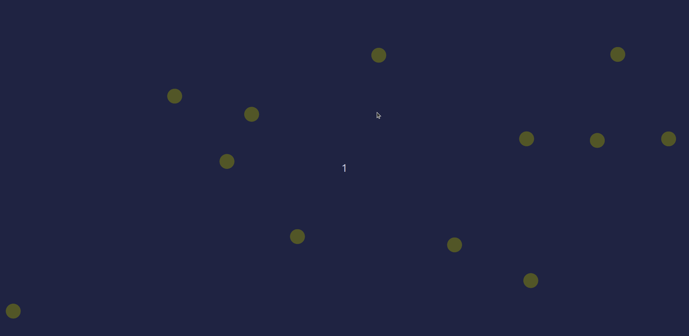

# bolas



Bolas is portuguese for "balls". Morei em Portugal durante três anos entre 2022 e 2025. Escrevi este projeto quando
estava a morar lá, portanto, chamo-o "bolas".

This is a dumb little physics simulator where you can click and drag in a slingshot-type motion and
fling balls around a canvas.

This was mostly an excuse to write some rust I could show on my github and to use websockets and the
actix web framework a bit on a side-project.

### Building and Developing Locally

You will need cargo installed to build/run locally. To start the server,
run the following, then navigate to http://localhost:23080 in your browser.

```
make run
```
